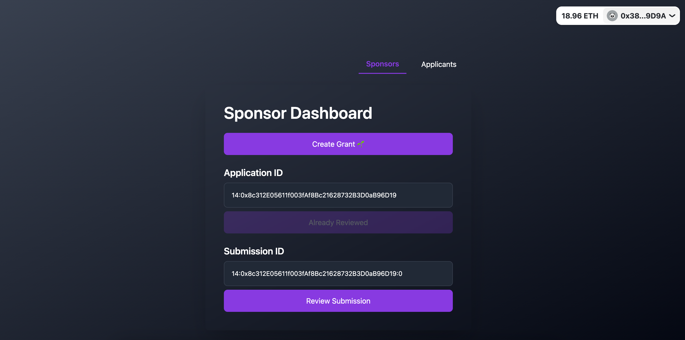
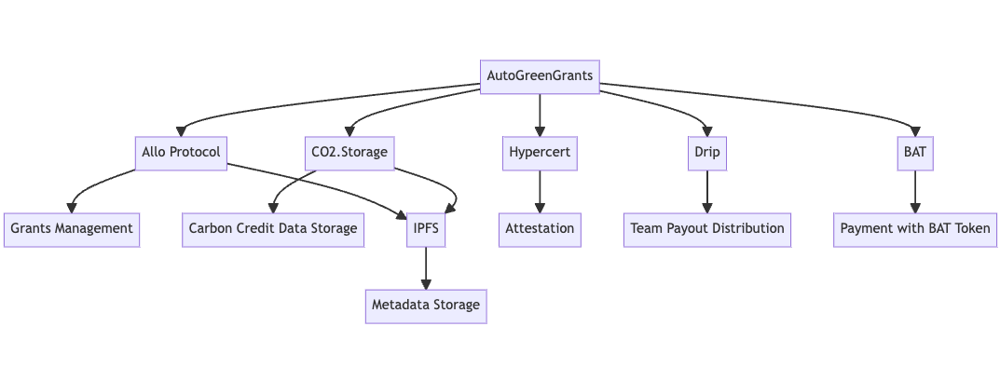

# AutoGreenGrants

## Description

**AutoGreenGrants** is an innovative grants platform designed to automate the process of:

- Distributing payouts to participants.
- Purchasing carbon credits while providing attestation to participants.

Driven by our mission to enhance the sustainability of grant distribution, we aim to establish a prominent, environment-friendly presence in the grants ecosystem.

## Live Application

https://auto-green-grants.vercel.app/

## Pitch Deck

https://docs.google.com/presentation/d/17jKICQBJbGnaEfGOp6Mx8G_FzpP4d6v-yA-tHc5fuFE/edit?usp=sharing

## Demo Video

Coming Soon!

## How It Works

### Allo Protocol

- **Functionality:** AutoGreenGrants is built on the Allo Protocol. This protocol manages various tasks such as profile creation, pool establishment, registration, reviewing, and the entire life cycle of the grant payout.
- **Carbon Credit Integration:** We've incorporated the purchase of carbon credits into Allo Protocol's `DirectGrantsSimpleStrategy`. A designated portion of the grant payout is automatically directed to the Carbon Credit provider.

### CO2.Storage and IPFS

- **Carbon Credit Data Storage:** When purchasing carbon credits, the transactional data—comprising the hash and pool info—is securely stored in CO2.Storage. This allows for transparent tracking of the positive environmental impacts contributed by participants.
- **Metadata & IPFS:** Allo Protocol necessitates metadata for operations like profile creation, pool setup, recipient registration, milestone setting, etc. These metadata operations utilize IPFS hashes and are stored via web3.storage.

### Hypercert

- **Attestation:** We employ Hypercert for attestation purposes. A generated Hypercert encapsulates the CO2.Storage asset ID, enabling a more flexible tracking system that's also verifiable on-chain.
- **Reputation-based Reviewing:** The attestation feature can be leveraged to execute reputation-based reviews within the Allo Protocol, potentially revolutionizing the grants ecosystem.

### Drip

- **Team Payout Distribution:** AutoGreenGrants has integrated Drip to facilitate the equitable distribution of payouts among team members.

### BAT

- **Payment Token:** The BAT token has been integrated and is used as the platform's primary payment token.
